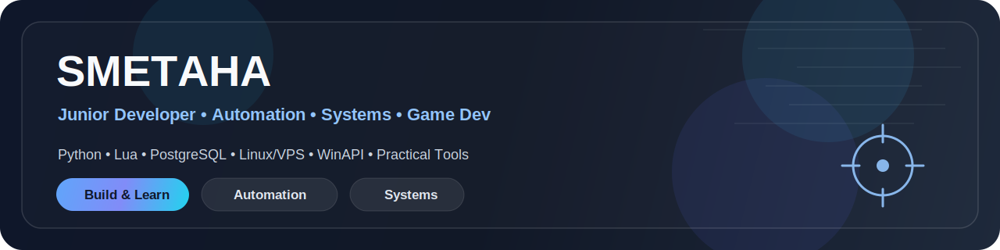

  

   
   

  
  

   
   

  
  
  
  
  

---

## 🌐 Language

<b>🇺🇸 English</b>

 

### Quick Navigation
- [About Me](#-about-me)
- [Tech Stack](#-tech-stack)
- [Featured Projects](#-featured-projects)
- [Current Focus](#-current-focus)
- [Contact](#-contact)

---

## ✨ About Me

I'm a junior developer with a practical mindset: I prefer learning through real projects, experiments, and solving non-trivial problems.

I mainly work with Python, Lua, JavaScript, and PostgreSQL. I'm especially interested in automation, system-level tools, backend logic, practical UI, and game-related systems.

<b>More about my interests</b>

 

- automation and QA/SDET-oriented tooling  
- system-level utilities for Windows and Linux  
- procedural generation and simulation systems  
- practical applications with thoughtful UI  
- GLSL shaders and graphics experiments  
- game development with a focus on mechanics and systems  

---

## 🛠 Tech Stack

<table>
  <tr>
    <td><b>Languages</b></td>
    <td>Python, Lua, JavaScript, HTML, CSS</td>
  </tr>
  <tr>
    <td><b>Frameworks / Tools</b></td>
    <td>Django, Flask, Love2D, PySide6</td>
  </tr>
  <tr>
    <td><b>Database</b></td>
    <td>PostgreSQL</td>
  </tr>
  <tr>
    <td><b>Systems</b></td>
    <td>Linux, VPS, networking, Windows API</td>
  </tr>
  <tr>
    <td><b>Interests</b></td>
    <td>Automation, QA/SDET, desktop tools, procedural generation, GLSL shaders</td>
  </tr>
</table>

---

## 🚀 Featured Projects

<table>
  <tr>
    <td width="50%" valign="top">

### 🪟 Window Sniper
Windows utility for real-time inspection of windows under the cursor.

**Highlights**
- WinAPI integration  
- overlay UI  
- global hotkeys  
- multiple output formats  
- configuration system  
- RU/EN localization  

**Repo**  
[Window-Sniper](https://github.com/SMETAHA/Window-Sniper)

</td>
    <td width="50%" valign="top">

### 🤖 Web Automation Extension
Browser extension for automating actions in dynamic web interfaces.

**Highlights**
- DOM interaction  
- scenario logic  
- async processes  
- configurable behavior  
- extension-based architecture  

**Repo**  
[auto-fishing-bot](https://github.com/SMETAHA/auto-fishing-bot)

</td>
  </tr>
</table>

<b>Project focus</b>

 

These projects reflect the areas I’m currently growing in:
- practical automation  
- system-level tooling  
- UI-driven utilities  
- projects that combine logic, usability, and technical depth  

---

## 🎯 Current Focus

- improving project presentation and documentation  
- building a stronger GitHub portfolio  
- exploring automation, QA/SDET, and practical software tools  
- developing simulation and procedural systems for game-related projects  

---

## 📫 Contact

- GitHub: [SMETAHA](https://github.com/SMETAHA)

<b>🇷🇺 Русский</b>

 

### Быстрая навигация
- [Обо мне](#-обо-мне)
- [Стек](#-стек)
- [Проекты](#-проекты)
- [Текущий фокус](#-текущий-фокус)
- [Контакты](#-контакты)

---

## ✨ Обо мне

Я начинающий разработчик с практическим подходом: предпочитаю учиться через реальные проекты, эксперименты и решение нетривиальных задач.

Работаю в основном с Python, Lua, JavaScript и PostgreSQL. Больше всего интересуюсь автоматизацией, системными инструментами, backend-логикой, практичными интерфейсами и игровыми системами.

<b>Подробнее об интересах</b>

 

- автоматизация и инструменты в духе QA/SDET  
- системные утилиты для Windows и Linux  
- процедурная генерация и симуляции  
- прикладные приложения с продуманным UI  
- шейдеры GLSL и графические эксперименты  
- геймдев с упором на механику и системы  

---

## 🛠 Стек

<table>
  <tr>
    <td><b>Языки</b></td>
    <td>Python, Lua, JavaScript, HTML, CSS</td>
  </tr>
  <tr>
    <td><b>Фреймворки / инструменты</b></td>
    <td>Django, Flask, Love2D, PySide6</td>
  </tr>
  <tr>
    <td><b>База данных</b></td>
    <td>PostgreSQL</td>
  </tr>
  <tr>
    <td><b>Системы</b></td>
    <td>Linux, VPS, сети, Windows API</td>
  </tr>
  <tr>
    <td><b>Интересы</b></td>
    <td>Автоматизация, QA/SDET, desktop-инструменты, процедурная генерация, GLSL</td>
  </tr>
</table>

---

## 🚀 Проекты

<table>
  <tr>
    <td width="50%" valign="top">

### 🪟 Window Sniper
Инструмент для получения информации об окнах под курсором в реальном времени.

**Особенности**
- работа с WinAPI  
- overlay-интерфейс  
- глобальные хоткеи  
- несколько форматов вывода  
- система конфигурации  
- поддержка RU/EN  

**Репозиторий**  
[Window-Sniper](https://github.com/SMETAHA/Window-Sniper)

</td>
    <td width="50%" valign="top">

### 🤖 Web Automation Extension
Браузерное расширение для автоматизации действий в динамических веб-интерфейсах.

**Особенности**
- работа с DOM  
- сценарная логика  
- асинхронные процессы  
- настраиваемое поведение  
- архитектура расширения  

**Репозиторий**  
[auto-fishing-bot](https://github.com/SMETAHA/auto-fishing-bot)

</td>
  </tr>
</table>

<b>О проектах</b>

 

Эти проекты отражают направления, в которых я сейчас развиваюсь:
- практическая автоматизация  
- системные инструменты  
- утилиты с интерфейсом  
- проекты, сочетающие логику, удобство и техническую глубину  

---

## 🎯 Текущий фокус

- улучшение оформления и презентации проектов  
- развитие GitHub-портфолио  
- изучение автоматизации и QA/SDET  
- разработка симуляционных и процедурных систем  

---

## 📫 Контакты

- GitHub: [SMETAHA](https://github.com/SMETAHA)

---

  Thanks for visiting my profile • Спасибо за просмотр профиля

